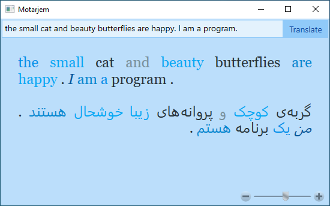
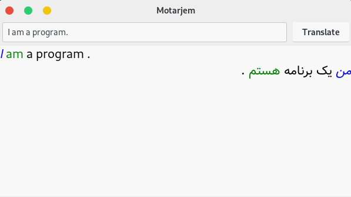

# Motarjem (Discontinued)
Motarjem is an offline translator that uses Natural Language Processing 
to parse and translate English sentences to Persian.
Project development cancelled incompletely for a lot of reasons and problems.

# Screenshots
Motarjem v0.2 beta on Windows



Motarjem GTK v0.2 beta on Linux



# Features
* Parsing and Translating Simple English Sentences to Persian
* Small Vocabulary written in SQLite3
* Linux (GTK) and Windows Support

# To Do
* Extending Vocabulary
* Adding Proper Nouns to Vocabulary
* Parsing and Translating Conditions
* Parsing and Translating Questions
* Parsing and Translating from Persian
* Android Support

# Building on Windows
You can use "Visual Studio" to build this project.

Also, You can run `MSBuild` from "Developer Command Prompt".

```
> nuget restore
> msbuild motarjem\motarjem.csproj
```

You will need [sqlite3 library](https://www.sqlite.org) to run application.
You should [download](https://www.sqlite.org/download) it then 
copy it to the folder containing Motarjem's executable manually.

# Building on Linux
Install 'Mono', 'MSBuild', 'NuGet' and 'SQLite'.

Building application:

```
$ msbuild ./Motarjem.Gtk/Motarjem.Gtk.csproj
```

Running application:

```
$ mono ./Motarjem.Gtk/bin/Debug/Motarjem.Gtk.exe
```

# License
the project is open source and freely can be used for your personal or commerical works,
But for publishing you should mention you are using codes from this project, 
and you should include this message.
