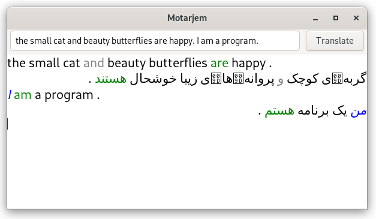

# Motarjem
Motarjem is an offline translator that uses Natural Language Processing 
to parse and translate English sentences to Persian.

# Screenshots
Motarjem v0.2 beta on Windows

Motarjem GTK v0.2 beta on Linux

# Features
* Parsing and Translating Simple English Sentences to Persian
* Small Vocabulary
* Linux (GTK) and Windows Support

# To Do
* Use SQL database for Vocabulary
* Extending Vocabulary
* Adding Proper Nouns to Vocabulary
* Parsing and Translating Conditions
* Parsing and Translating Questions
* Parsing and Translating from Persian
* Android Support

# License
the project is open source and freely can be used for your personal or commerical works,
But for publishing you should mention you are using codes from this project, and you should
include this message.
